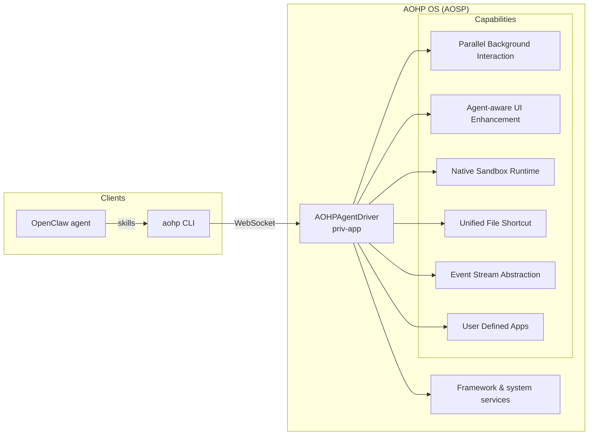

# AOHPAgentDriver

**[中文说明](README.zh-CN.md)**

AOHPAgentDriver is a system-level priv-app on AOHP (Android Open Harness Project). Its role is to expose AOHP OS system capabilities to agents through a single local JSON-RPC WebSocket service.

## Role in the system

