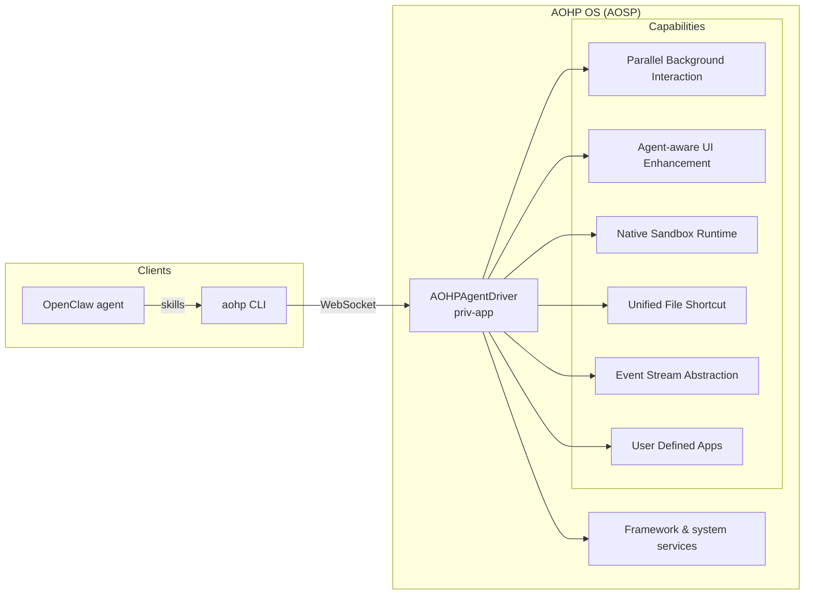

# AOHPAgentDriver

**[English](README.md)**

AOHPAgentDriver 是 AOHP（Android Open Harness Project）上的系统级 priv-app。它的职责是将 AOHP OS 的系统能力暴露给 Agent 使用，统一通过本地 JSON-RPC WebSocket 服务对外提供。

## 在系统中的角色

```mermaid
flowchart LR
    subgraph Clients
        OC[OpenClaw agent]
        CLI[aohp CLI]
    end

    subgraph AOHP["AOHP OS (AOSP)"]
        AD[AOHPAgentDriver<br/>priv-app]
        subgraph Capabilities
            PBI[Parallel Background Interaction]
            AUI[Agent-aware UI Enhancement]
            NSR[Native Sandbox Runtime]
            UFS[Unified File Shortcut]
            ESA[Event Stream Abstraction]
            UDA[User Defined Apps]
        end
        FW[Framework & system services]
    end

    OC -->|skills| CLI
    CLI -->|WebSocket| AD
    AD --> PBI & AUI & NSR & UFS & ESA & UDA
    AD --> FW
```
